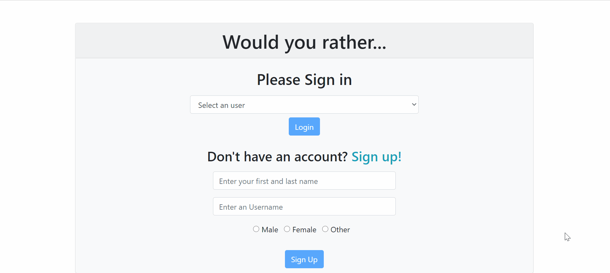

  

# Would You Rather...

This project was made during [Udacity's React Nanodegree](https://www.udacity.com/course/react-nanodegree--nd019) and it is a web app that lets a user play the “Would You Rather?” game.

**The game goes like this:** A user is asked a question in the form: “Would you rather [option A] or [option B] ?”. Answering "neither" or "both" is against the rules.

In this app, users are able to answer questions, see which questions they haven’t answered, see how other people have voted, post questions, and see the ranking of users on the leaderboard.

## Technologies used

[React](https://reactjs.org/), [Redux Toolkit](https://redux-toolkit.js.org/) & [React-Bootstrap](https://react-bootstrap.github.io/).

## Starting the App

- Install al the project dependencies with `npm install`;
- Start the development server with `npm start`.

**Obs: Since this app was created with the newly released npm version 7, it creates a package-lock.json version 2, which may cause some problems if you don't have this npm version. In this case, you should install and start the app with yarn install and yarn start. [Here are the instructions to install yarn](https://yarnpkg.com/getting-started/install)**

**Obs²: With NPM version 7, they introduced [Peer dependencies](https://github.blog/2021-02-02-npm-7-is-now-generally-available/#peer-dependencies). And some packages have not released versions that are made for React 17 (or another new package), but that doesn't mean that those packages don't work. If you face this issue, you can use --force, or --legacy-peer-deps, [here is a more detailed explanation](https://stackoverflow.com/questions/66020820/npm-when-to-use-force-and-legacy-peer-deps/66035709).**

## Contributions

Any contributtions and/or suggestions are greatly appreciated.

## License

[MIT License](https://opensource.org/licenses/MIT).
